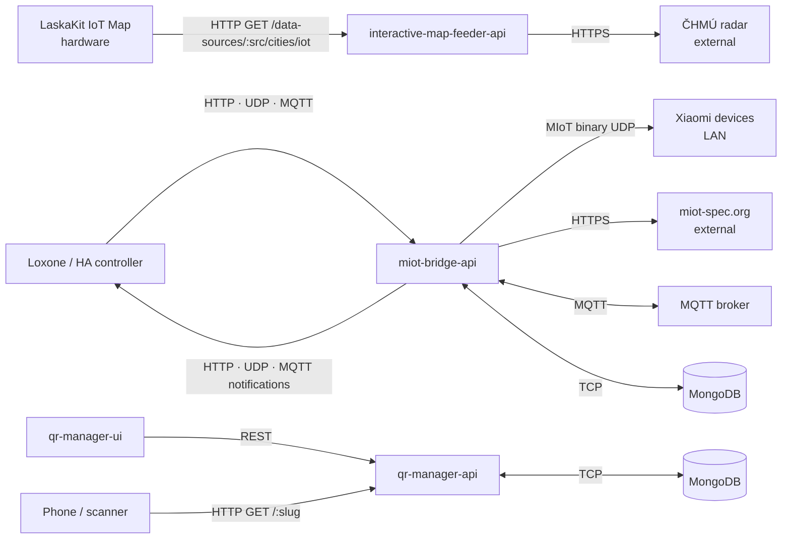

# IoT Miniservers — Knowledge Base

> Maintained by `/update-docs` skill. Last updated: 2026-08-01.

pnpm monorepo of small independent Node.js APIs and UIs (Ts.ED, TypeScript ESM).

## Apps

| Name | Type | Purpose |
|------|------|---------|
| `interactive-map-feeder-api` | API | Fetches ČHMÚ precipitation radar, composites image layers, serves city LED RGB values for LaskaKit IoT map |
| `miot-bridge-api` | API | Gateway between home automation controllers and Xiaomi MIoT devices. Manages device registry, translates commands, polls properties, dispatches change notifications |
| `qr-manager-api` | API | QR code redirect manager: allocates slugs, stores slug→URL, resolves via 302 redirect, renders QR images |
| `qr-manager-ui` | UI | Admin UI for `qr-manager-api`: create/edit/deactivate QR records, download images |

## Shared Packages

| Package | Purpose |
|---------|---------|
| `@radoslavirha/http-provider` | Auth-aware axios factory from Zod config: auth strategies, transport interpolation, optional resilience policy |
| `@radoslavirha/miot-device` | Stateful MIoT device client: UDP transport, per-device stamp/handshake lifecycle |
| `@radoslavirha/otel` | OpenTelemetry bootstrap — traces + custom metrics via OTLP; logs via stdout JSON (no OTLP log export) |
| `@radoslavirha/resilience` | Transport-agnostic timeout / retry / circuit breaker over `AbortSignal`, backed by cockatiel |
| `@radoslavirha/tsed-resilience` | Ts.ED `@RequestSignal()` decorator — an `AbortSignal` tied to the HTTP request lifecycle |
| `@radoslavirha/ui-kit` | Shared design system and UI components for the UIs |

## Observability (OTel signal routing)

| Signal | Transport | Notes |
|--------|-----------|-------|
| Traces | OTLP → alloy-receiver:4318/v1/traces | `WinstonInstrumentation` injects `trace_id`/`span_id` into every JSON log line |
| Custom metrics | OTLP → alloy-receiver:4318/v1/metrics | App-level counters/histograms only |
| Logs | stdout JSON → Alloy podLogs DaemonSet | Alloy parses JSON, extracts `trace_id` as Loki structured metadata; Grafana derived field links log row → Tempo trace |
| Node/host metrics | k8s-monitoring (node-exporter) | `HostMetrics` SDK instrumentation removed — k8s-monitoring covers node/container level |

`logs.enabled` in `OtelConfig` defaults to `false` in production helm values. OTLP log export can be re-enabled at any time for debugging by setting `logs.enabled: true`.

## Communication

## External Dependencies

| App | System | Protocol | Direction | Purpose |
|-----|--------|----------|-----------|---------|
| `interactive-map-feeder-api` | ČHMÚ | HTTPS GET | outbound | Precipitation radar images |
| `miot-bridge-api` | Xiaomi devices (LAN) | MIoT binary UDP | bidirectional | Device control, property read |
| `miot-bridge-api` | miot-spec.org | HTTPS GET | outbound | Device capability spec (on registration) |
| `miot-bridge-api` | MQTT broker | MQTT | bidirectional | Inbound commands, outbound notifications |
| `miot-bridge-api` | MongoDB | TCP | bidirectional | Device and notification storage |
| `qr-manager-api` | MongoDB | TCP | bidirectional | Slug→URL storage |
