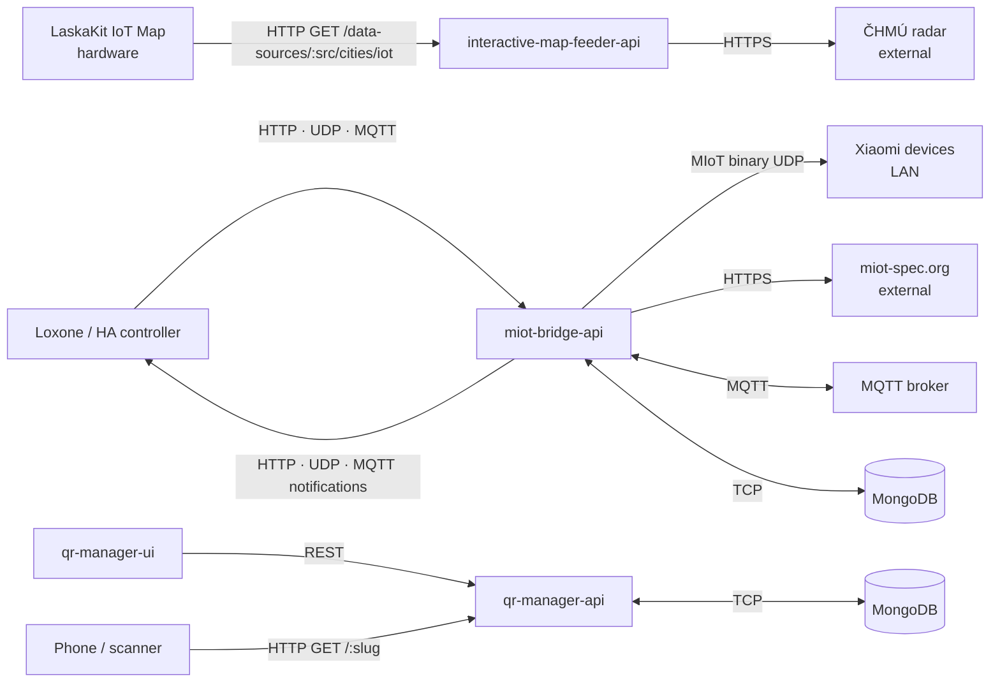

# IoT Miniservers — Knowledge Base

> Maintained by `/update-docs` skill. Last updated: 2026-08-01.

pnpm monorepo of small independent Node.js APIs and UIs (Ts.ED, TypeScript ESM).

## Apps

| Name | Type | Purpose |
|------|------|---------|
| `interactive-map-feeder-api` | API | Fetches ČHMÚ precipitation radar, composites image layers, serves city LED RGB values for LaskaKit IoT map |
| `miot-bridge-api` | API | Gateway between home automation controllers and Xiaomi MIoT devices. Manages device registry, translates commands, polls properties, dispatches change notifications |
| `qr-manager-api` | API | QR code redirect manager: allocates slugs, stores slug→URL, resolves via 302 redirect, renders QR images |
| `qr-manager-ui` | UI | Admin UI for `qr-manager-api`: create/edit/deactivate QR records, download images |
| `homelab-dashboard-ui` | UI | Dashboard UI for homelab services, driven by Unifi DNS records |

## Shared Packages

| Package | Purpose |
|---------|---------|
| `@radoslavirha/health` | Framework-free health check contract, registry and `application/health+json` report. Checks declare `critical`, which decides whether a failure gates readiness |
| `@radoslavirha/http-provider` | Auth-aware axios factory from Zod config: auth strategies, transport interpolation, resilience policy. Framework-free, no logging |
| `@radoslavirha/miot-device` | Stateful MIoT device client: UDP transport, per-device stamp/handshake lifecycle |
| `@radoslavirha/otel` | OpenTelemetry bootstrap — traces + custom metrics via OTLP; logs via stdout JSON (no OTLP log export) |
| `@radoslavirha/resilience` | Transport-agnostic timeout / retry / circuit breaker over `AbortSignal`, backed by cockatiel |
| `@radoslavirha/tsed-health` | Ts.ED wiring for `health` — `/health/live`, `/health/ready`, `/health`, a `HEALTH_CHECKS` provider-type registry, and the SIGTERM drain sequence. Ships `MongoHealthCheck` on the `/mongoose` subpath (optional peers, so database-free apps never resolve mongoose) |
| `@radoslavirha/tsed-http-provider` | Ts.ED wiring for `http-provider` — builds clients from `externalApis` config and adds redacted outbound request/response logging |
| `@radoslavirha/tsed-resilience` | Ts.ED `@RequestSignal()` decorator — an `AbortSignal` tied to the HTTP request lifecycle |
| `@radoslavirha/ui-auth` | OIDC authorization-code + PKCE login for the browser apps. Public client, **access token in memory only**, and **no iframe anywhere** — Authentik sets `X-Frame-Options: DENY`, so session recovery and renewal are top-level `prompt=none` redirects |
| `@radoslavirha/ui-kit` | Shared design system and UI components for the UIs |

## Frontend auth

`qr-manager-ui` logs in through Authentik (`auth.irha.cz`) as a public client. The whole app is gated:
an anonymous visitor gets a sign-in page and none of the routes. **That is UX, not security** — no API
verifies a token yet, so an unauthenticated request still returns everything until Phase 1b.

Four facts that are load-bearing and easy to get wrong:

- **No iframe.** `X-Frame-Options: DENY` on every Authentik response. Recovery, renewal and SSO are all
  top-level `prompt=none` redirects. A `302` passes through a frame unblocked, so an iframe approach
  appears to work until Authentik renders an actual page — which is how it survived review once.
- **SSO is global and so is logout.** One session covers all four `qr-manager` applications across both
  clusters and both stages; logging out of any one signs out of all of them. There is no per-environment
  logout.
- **`roles` is identical in every environment** (`qr-manager.admin`, no cluster, no stage). Only `iss`
  and `aud` separate a sandbox token from a production one, which is why `issuer_mode: per_provider`
  matters and why a verifier must pin `iss` and check `aud` by membership.
- **Config is templated per deployment.** The `homelab` values files are shared by both clusters, so
  `clientId`, `issuer` and `redirectUri` render from `VAR_CLUSTER` / `NAMESPACE`. Literals there would
  point server2 at server1's application.

`http://localhost:5173/callback` is registered on **sandbox applications only**, so `pnpm dev` performs
a real login against the real IdP. Use the **`verify-auth-in-browser`** skill before calling any auth
change done: six bugs in this area passed a green test suite.

Contract: [`superpowers/specs/2026-09-04-authentik-integration-contract.md`](./superpowers/specs/2026-09-04-authentik-integration-contract.md).

## Observability (OTel signal routing)

| Signal | Transport | Notes |
|--------|-----------|-------|
| Traces | OTLP → alloy-receiver:4318/v1/traces | `WinstonInstrumentation` injects `trace_id`/`span_id` into every JSON log line |
| Custom metrics | OTLP → alloy-receiver:4318/v1/metrics | App-level counters/histograms only |
| Logs | stdout JSON → Alloy podLogs DaemonSet | Alloy parses JSON, extracts `trace_id` as Loki structured metadata; Grafana derived field links log row → Tempo trace |
| Node/host metrics | k8s-monitoring (node-exporter) | `HostMetrics` SDK instrumentation removed — k8s-monitoring covers node/container level |

`logs.enabled` in `OtelConfig` defaults to `false` in production helm values. OTLP log export can be re-enabled at any time for debugging by setting `logs.enabled: true`.

### Every entry point owns a root span

A log line without a `trace_id` is a missing span, not a logging fault: `WinstonInstrumentation` reads the id off the active span. The same missing span turns every Mongo query underneath into a parentless single-span trace — the miot-bridge poller produced ~7,500 of those per 6 hours before it had one.

| Entry point | Root span from |
|---|---|
| Inbound HTTP | `HttpInstrumentation` / `ExpressInstrumentation` |
| Inbound + outbound MQTT | `withMqttConsumeSpan` / `withMqttPublishSpan` (`packages/otel`), per-app broker identity via `MqttTracingService` |
| Poll tick, startup task, any scheduled work | `runJob` (`packages/otel/src/jobTelemetry.ts`) — span **and** `job.*` metrics |
| Inbound UDP datagram | `withEntryPointSpan` (`packages/otel/src/spanTracing.ts`) |
| miot device UDP call, other uninstrumented outbound calls | `withClientSpan`, wrapped for miot by `apis/miot-bridge-api/src/otel/miotTracing.ts` |

Span names, tracer scopes, `job.name` values and `miot.*` attribute keys are constants in `apis/<api>/src/otel/telemetry.ts`. Adding a background job or listener: `.apm/skills/instrument-entry-point`.

**The poll tick is head-sampled.** At a 5s interval an always-on tick span is ~17k identical traces a day, which is what made a 6h Tempo search return nothing else. `DevicePropertyPollerService` traces at most one tick per `polling.traceIntervalMs` (default 60s) plus every tick that polls a device already failing; the rest run with tracing *suppressed*, so their Mongo and UDP calls are dropped instead of becoming orphan traces. The cost: a property change detected in a suppressed tick publishes its notification untraced. Set `polling.traceIntervalMs: 0` to trace every tick.

### Scheduled work is a metrics problem, not a tracing problem

A cron is deterministic — same work, same inputs, every tick — so correlating a log line to one exact iteration buys almost nothing; a fault that recurs every tick shows up in any of them. Traces are the sampled deep dive; **metrics are the always-on answer to "is this job healthy"**. `runJob` emits both from one call so the next job author cannot get only one, and **a run sampled out of tracing still records its metrics** — otherwise the sampling rate silently becomes the run rate.

Three reusable instruments, repo-local namespace (OpenTelemetry has no convention for in-process scheduled jobs; `faas.*` was rejected as claiming FaaS semantics a `setTimeout` does not have, `cicd.pipeline.run.*` lent its shape):

| Metric | Instrument | Unit | Attributes |
|---|---|---|---|
| `job.run.duration` | Histogram | `s` | `job.name`, `job.run.outcome` |
| `job.run.skips` | Counter | `{skip}` | `job.name`, `job.skip.reason` |
| `job.run.items` | Counter | `{item}` | `job.name`, `job.item.outcome` |

`job.name` must be a bounded static set — every value is a permanent series on all three. ~64 series per `miot-bridge-api` pod.

**`job.run.items` is what makes the poller's health legible.** The tick catches each device fault itself and turns it into back-off, so the *run* always reports success — run outcome alone would call the job healthy with every device dead.

**The poller cannot overrun, it runs late.** `scheduleNext` re-arms a `setTimeout` in `tick`'s `finally`, after the awaited work, so exactly one timer is ever armed: its `_ticking` guard is unreachable and emits no `overrun` skip. The effective period is `intervalMs + tick duration`, which is why production ticks arrive ~5.6s apart against a 5s setting. That drift needs no metric of its own — for a self-rescheduling chain there is no missed deadline to be late against, and `1 / (rate(job_run_duration_seconds_count) + rate(job_run_skips_total))` already gives the effective period.

### Health probe traffic is excluded from telemetry

`/health*` and `/healthz` produce no spans (`HttpInstrumentation.ignoreIncomingRequestHook` in `@radoslavirha/otel`) and no request-log lines (`requests.ignorePaths` in `@radoslavirha/tsed-logger`, on by default). At ~0.3 req/s per pod forever, they would otherwise dominate both Tempo and Loki while carrying no information.

The trace hook also suppresses `http.server.request.duration` for those paths — deliberate, since probe traffic is fast and constant-rate and would dilute every percentile of the real-traffic latency histogram. **Probe state is therefore a Kubernetes-layer fact only**, and must come from kube-state-metrics. `kube_pod_status_ready` **is** collected — added to the kube-state-metrics allow-list in `homelab` → `gitops/helm-values/k8s-monitoring.yaml`, alongside kubelet's `prober_*` counters, which say *which* probe failed. Reference: `homelab` → `docs/observability.md`. No alert consumes either metric yet, so a readiness failure is visible but silent.

## Communication

## External Dependencies

| App | System | Protocol | Direction | Purpose |
|-----|--------|----------|-----------|---------|
| `interactive-map-feeder-api` | ČHMÚ | HTTPS GET | outbound | Precipitation radar images |
| `miot-bridge-api` | Xiaomi devices (LAN) | MIoT binary UDP | bidirectional | Device control, property read |
| `miot-bridge-api` | miot-spec.org | HTTPS GET | outbound | Device capability spec (on registration) |
| `miot-bridge-api` | MQTT broker | MQTT | bidirectional | Inbound commands, outbound notifications |
| `miot-bridge-api` | MongoDB | TCP | bidirectional | Device and notification storage |
| `qr-manager-api` | MongoDB | TCP | bidirectional | Slug→URL storage |
